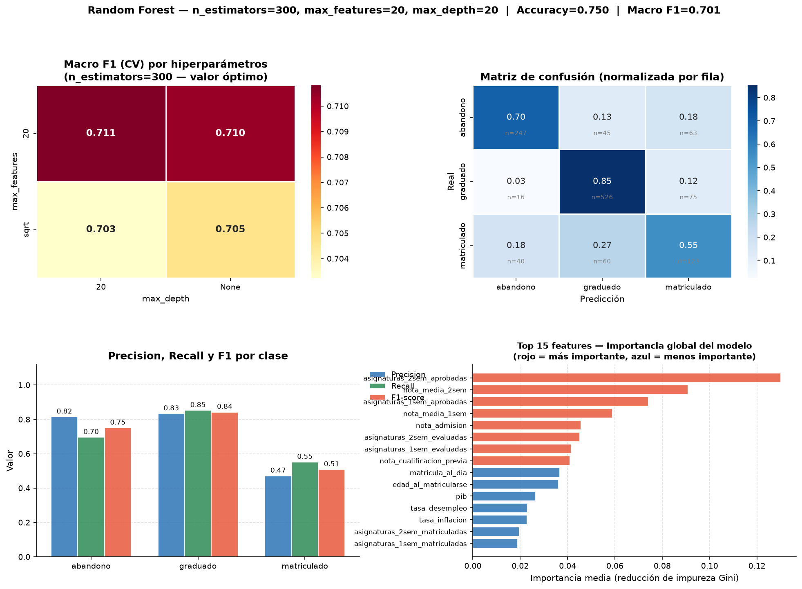
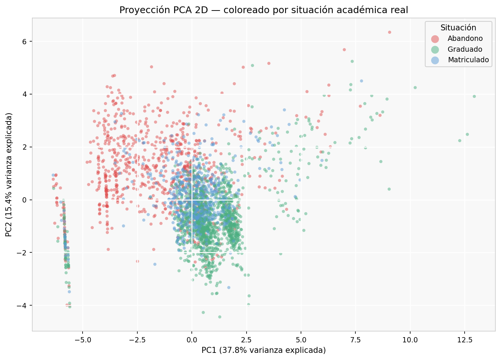
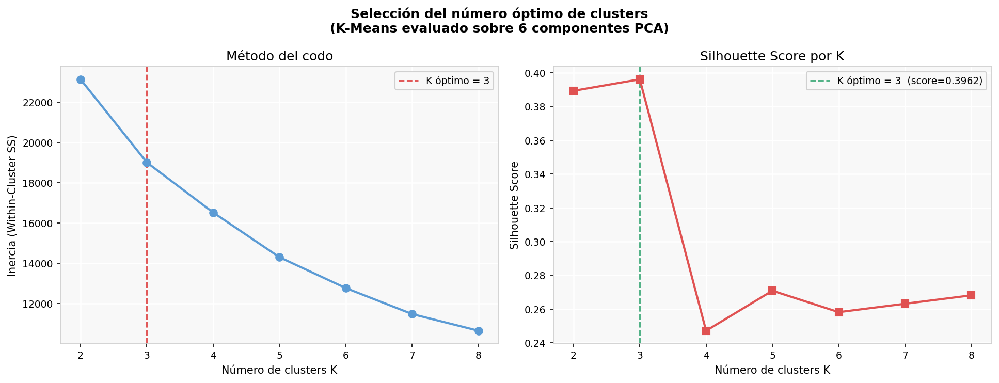

# 🎓 Student Performance Prediction — End-to-End Machine Learning

Predicting whether a university student will **drop out, stay enrolled or graduate**, and forecasting their **2nd-semester grade**, on a dataset of **4,424 students** with 36 socio-economic, academic and macro-economic features.

The project covers the whole ML workflow: preprocessing, supervised classification, regression, unsupervised learning and a class-imbalance study. Every modelling decision is justified in the notebooks.

> Final project for *Machine Learning* (B.Sc. Mathematical Engineering & AI, Universidad Pontificia Comillas ICAI, 2025/26). Code and analysis are in Spanish.

---

## 📊 Key results

**Classification (3 classes: dropout / enrolled / graduate) — test set**

| Model | Macro F1 | Accuracy | F1 dropout | F1 graduate | F1 enrolled |
|---|---|---|---|---|---|
| Logistic Regression (Lasso, C = 0.1) | **0.714** | **0.751** | **0.764** | 0.840 | **0.537** |
| KNN (K = 7, Manhattan) | 0.584 | 0.685 | 0.623 | 0.795 | 0.334 |
| Random Forest (300 trees, depth 20, 20 features/split) | 0.701 | 0.750 | 0.751 | **0.843** | 0.508 |

*These are the numbers produced by running the scripts in this repository (test set = 30 %, stratified). The PDF report is an earlier write-up and may differ slightly.*

**Regression (2nd-semester grade):** Lasso (α = 0.1) → **R² = 0.749** on the test set, keeping 54 of 92 features. The features known only after the 2nd semester were removed first to avoid data leakage.

**Unsupervised:** PCA reduces 14 student-level variables to **6 components (83.6 % of the variance)**. K-Means then runs on that reduced space, and the clusters are checked for stability with the Adjusted Rand Index.

### What the analysis found
- 1st-semester performance is the strongest signal in every task.
- The *enrolled* class is hard to classify: those students are still "in transit", so their profiles overlap with both dropouts and graduates.
- The strong regularisation chosen by Lasso and Ridge revealed heavy collinearity between same-semester academic variables. The collinearity analysis later confirmed it.
- Oversampling with SMOTE does **not** beat simply weighting the classes (`class_weight="balanced"`). Macro F1 is 0.693 vs 0.714 for logistic regression and 0.698 vs 0.700 for random forest. The comparison is in `resumenes/resumen_smote_adicional.ipynb`.



| PCA projection coloured by real outcome | Choosing K (elbow + silhouette) |
|---|---|
|  |  |

---

## 🛠️ Pipeline

1. **Preprocessing** (`preprocessing.py`)
   - Semantic grouping of high-cardinality categories (e.g. 46 parental occupations).
   - Label encoding and one-hot encoding.
   - Yeo-Johnson / Box-Cox transforms for skewed variables.
   - Outlier handling.
   - Stratified split and a `StandardScaler` fitted on train only (no leakage).
2. **Classification**: logistic regression, KNN and random forest, each tuned with `GridSearchCV` (k = 5).
3. **Regression**: Ridge vs Lasso to predict the continuous grade.
4. **Unsupervised**: PCA, then K-Means, cluster profiling and a stability analysis.
5. **Extra**: SMOTE vs class weighting for the imbalanced classes.

## 📁 Repository structure

```
├── rendimiento_estudiantes.csv   # dataset
├── preprocessing.py              # run FIRST — creates data_processed/
├── models/
│   ├── logistic_regression.py
│   ├── knn.py
│   ├── random_forest.py
│   ├── linear_regression.py
│   ├── unsupervised.py
│   └── smote.py
├── resumenes/                    # notebooks with the full reasoning & conclusions
│   └── decisiones_disenyo.ipynb  # every design decision, justified
├── figures/                      # generated plots
└── docs/report_es.pdf            # written report (Spanish)
```

## ▶️ How to run

```bash
pip install -r requirements.txt
python preprocessing.py            # ~5 s — generates data_processed/
python models/logistic_regression.py
python models/knn.py
python models/random_forest.py
python models/linear_regression.py
python models/unsupervised.py
python models/smote.py             # slowest one: ~2–3 min
```
Each script prints its metrics and saves its plots to `figures/`. All the scripts together take about 5 minutes on a 2-core machine. Tested with Python 3.10 and 3.11.

## 🧰 Tech stack
Python · pandas · NumPy · scikit-learn · imbalanced-learn · SciPy · Matplotlib · Seaborn · Jupyter

## 📚 Data
Based on the *Predict Students' Dropout and Academic Success* dataset (UCI Machine Learning Repository), with the columns translated to Spanish.

## 👤 Author
**Mateo Gómez-Acebo Girardet**
